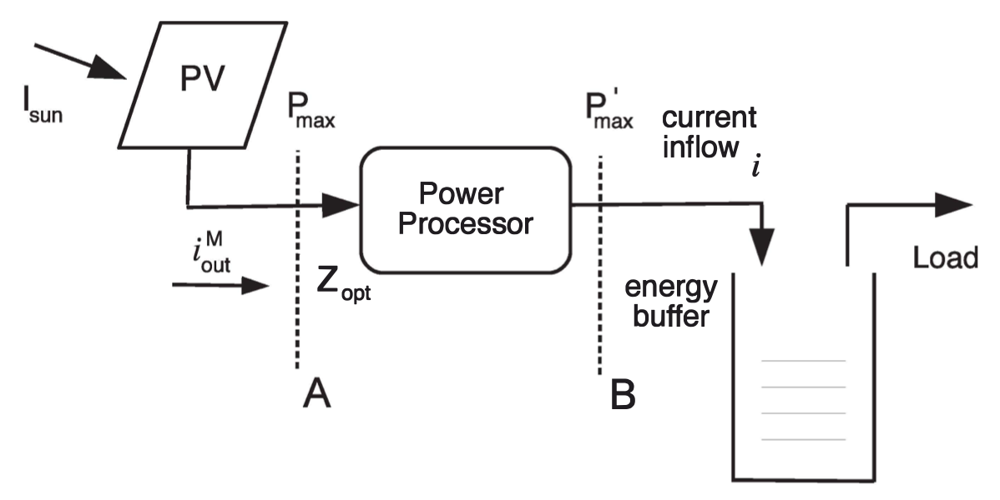
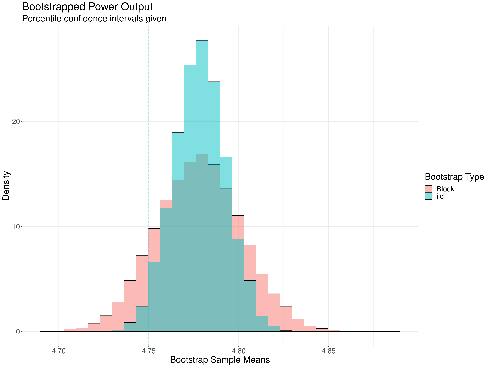

# Motivation

- Renewable energy solutions
- Problem: balance contribution of PV modules with demand on electrical grid
  - Our work deals with the expected PV contribution

# Research Question

- _SolarStat: Modeling Photovolatic Sources through Stochastic Markov Processes_

- *Their objective*: 
  - Solar irradiance $\rightarrow$ current output 
  - Cluster results with a Markov model
- *Our objective*: 
  - Solar irradiance $\rightarrow$ current output 
  - Compare iid and time series bootstrap

# Background

- The paper used data from LA, 1991-2010
- The paper uses ETR (we used similar GHI)
- Simulates for a specific model of small solar panel 
- Panels "laid out" in a 6x6 grid.

# Data 

::: columns
:::: column

::::
:::: column

::::
:::

- National Solar Radiation Database (NSRDB) from National Renewable Energy
Laboratory (NREL)
- Los Angeles data for 1998-2010

# Overall process

\begin{center}
Raw data (NSRDB)

$\downarrow$

Astronomical adjustment

$\downarrow$

PV module

$\downarrow$

Power processor

$\downarrow$

Bootstrap
\end{center}

# Preprocessing

1. Astronomical adjustment: GHI $\rightarrow$ effective irradiance
1. PV Module: Effective irradiance + voltage $\rightarrow$ current 
1. Power processor: Effective irradiance $\rightarrow$ current

# Postprocessed data

::: columns
:::: column

::::
:::: column

::::
:::

# Postprocessed data, cont.

::: columns
:::: column

::::
:::: column

::::
:::

# Bootstrapping

# Future Research

- A similar procedure could be performed on a different city's data like Fort Collins.
- A similar procedure could be performed over a different range of years. A comparison may reveal the effects of global warming.
- Our original source paper examined multiple PV modules simultaneously in the context of a larger grid. This examines both sides of the contribution/demand optimization problem.
